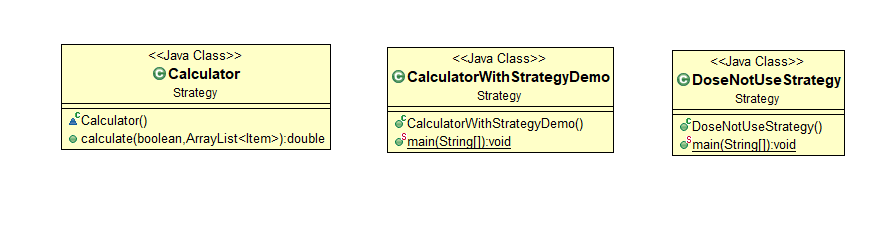
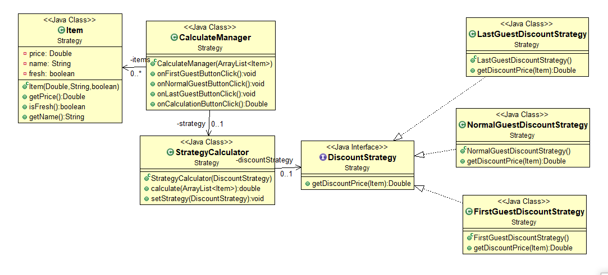
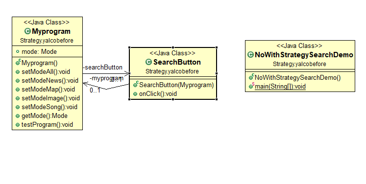
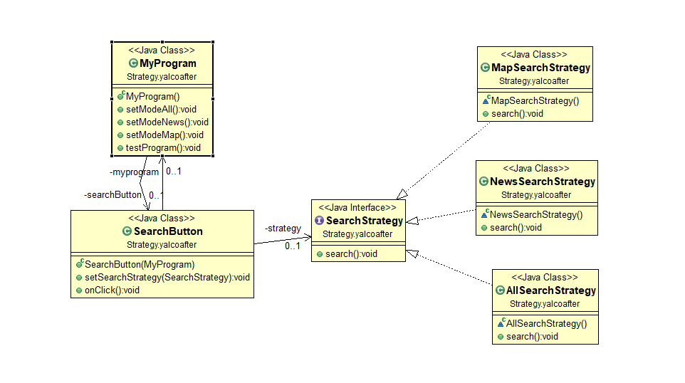

# 전략패턴

### 1. 한마디 정리

- **인터페이스**와 **위임**을 사용하여 특정 기능을 자유롭게 변경할때 사용하는 패턴
- 위임을 통해 의존성을 역전시킬 수 있고, 인터페이스를 통해 다형성의 특성으로 변경에 대해 유연한 대처가 가능하다.

### 2. 언제 쓰는가?

- 게임에서 무기를 바꿀때,

- 카테고리를 선택하고 그에 맞는 검색을 하고 싶을 때,

- 쿠폰의 종류가 많고 때에따라, 조건에 따라 할인률이 다를 때

- 스프링에서... 어디서 많이 봤다 했는데 sort할 때 쓰는 방법이 전략패턴이군

  > [Strategy](http://en.wikipedia.org/wiki/Strategy_pattern) (recognizeable by behavioral methods in an abstract/interface type which invokes a method in an implementation of a *different* abstract/interface type which has been *passed-in* as method argument into the strategy implementation)

  - [`java.util.Comparator#compare()`](http://docs.oracle.com/javase/8/docs/api/java/util/Comparator.html#compare-T-T-), executed by among others `Collections#sort()`.
  - [`javax.servlet.http.HttpServlet`](http://docs.oracle.com/javaee/7/api/javax/servlet/http/HttpServlet.html), the `service()` and all `doXXX()` methods take `HttpServletRequest` and `HttpServletResponse` and the implementor has to process them (and not to get hold of them as instance variables!).
  - [`javax.servlet.Filter#doFilter()`](http://docs.oracle.com/javaee/7/api/javax/servlet/Filter.html#doFilter-javax.servlet.ServletRequest-javax.servlet.ServletResponse-javax.servlet.FilterChain-)
  
  출처: https://stackoverflow.com/questions/1673841/examples-of-gof-design-patterns-in-javas-core-libraries/2707195#2707195

### 3. UML

1. 쿠폰의 종류를 경우에 따라 바꿀때

   - 전략패턴없이

   

   - 전략패턴 사용 시

     

2. 검색 카테고리를 바꿀 때

   - 전략패턴 적용 안할 시

   

   - 전략패턴 적용시

   

### 4. 예시

- 쿠폰 : https://github.com/SINHOLEE/OOP_TIL/tree/master/src/Strategy

- searchButton: https://github.com/SINHOLEE/OOP_TIL/tree/master/src/Strategy/yalcoafter

###  5. 참조

- 개발자가 반드시 정복해야 할 객체지향과 디자인 패턴

- from youtube

  - [얄팍한 코딩사전](https://www.youtube.com/channel/UC2nkWbaJt1KQDi2r2XclzTQ): 디자인패턴 1

  - [이야기's G](https://www.youtube.com/channel/UCtsaG2ePUxvo0-se9gkxEmg): [자바 디자인 패턴 이해] 1강 스트래티지 패턴(Strategy Pattern)