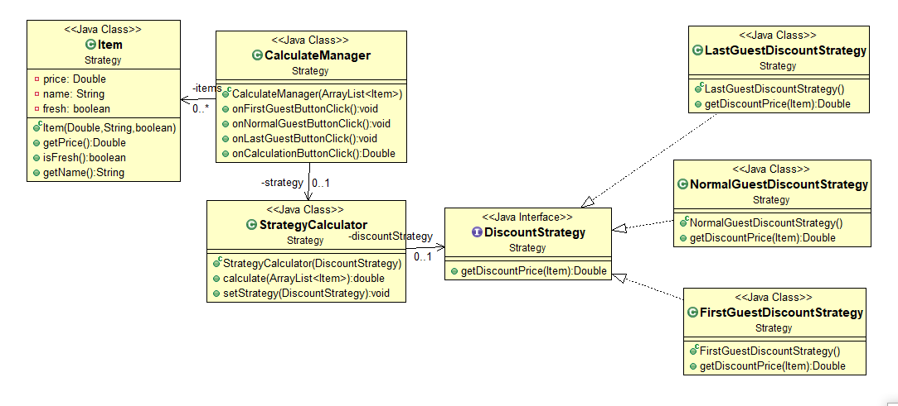

# 전략패턴

### 1. 한마디 정리

- **인터페이스**와 **위임**을 사용하여 특정 기능을 자유롭게 변경할때 사용하는 패턴
- 위임을 통해 의존성을 역전시킬 수 있고, 인터페이스를 통해 다형성의 특성으로 변경에 대해 유연한 대처가 가능하다.
- 단점: 인터페이스를 상속받는 구상 클래스가 너무 많아질 수도 있다.

### 2. 언제 쓰는가?

- 게임에서 무기를 바꿀때,

- 카테고리를 선택하고 그에 맞는 검색을 하고 싶을 때,

- 쿠폰의 종류가 많고 때에따라, 조건에 따라 할인률이 다를 때

- 스프링에서... 어디서 많이 봤다 했는데 sort할 때 쓰는 방법이 전략패턴이군

  > [Strategy](http://en.wikipedia.org/wiki/Strategy_pattern) (recognizeable by behavioral methods in an abstract/interface type which invokes a method in an implementation of a *different* abstract/interface type which has been *passed-in* as method argument into the strategy implementation)

  - [`java.util.Comparator#compare()`](http://docs.oracle.com/javase/8/docs/api/java/util/Comparator.html#compare-T-T-), executed by among others `Collections#sort()`.
  - [`javax.servlet.http.HttpServlet`](http://docs.oracle.com/javaee/7/api/javax/servlet/http/HttpServlet.html), the `service()` and all `doXXX()` methods take `HttpServletRequest` and `HttpServletResponse` and the implementor has to process them (and not to get hold of them as instance variables!).
  - [`javax.servlet.Filter#doFilter()`](http://docs.oracle.com/javaee/7/api/javax/servlet/Filter.html#doFilter-javax.servlet.ServletRequest-javax.servlet.ServletResponse-javax.servlet.FilterChain-)
  
  출처: https://stackoverflow.com/questions/1673841/examples-of-gof-design-patterns-in-javas-core-libraries/2707195#2707195

### 3. UML

1. 쿠폰의 종류를 경우에 따라 바꿀때 

   - 전략패턴없이

   

   - 전략패턴 사용 시

     

2. 검색 카테고리를 바꿀 때

   - 전략패턴 적용 안할 시

   

   - 전략패턴 적용시

   

### 4. 예시

>  무기를 가지고 예시를 든게 가장 깔끔하기 때문에 [이야기's G]의 예시를 차용해서 코드를 살펴보자.

- 명세서
  - 무기가 있다.
  - 무기에는 칼과 검이 있다.
  - 칼과 검은 각각 `공격`이라는 기능을 수행한다.
  - **도끼라는 무기를 추가해달라는 추가 요청이 생겼을 경우**

```java
// 이 예시는 전략패턴을 사용하지 않고 그냥 짯을 경우의 코드이다. 어디가 문제일까?
class Character{
	Weapon weapon = new Weapon("");
	public void attack() {
		weapon.attack();
	}
	public void setWeapon(String weapon) {
		this.weapon.setType(weapon);
	}
}

class Weapon{
	String type;
	public Weapon(String type) {
		this.type = type;
	}
	
	public void setType(String type) {
		this.type = type;
	}
	
	public void attack() {
		if (this.type == "") {
			System.out.println("맨손 공격");
		} else {			
			System.out.println(type + " 공격");
		}
	}
}


public class Game {
	public static void main(String[] args) {
		Character jungHwan = new Character();
		// 길을 걷가가 몬스터를 만나서 공격을 합니다.
		jungHwan.attack();
		
		// 검을 줏었습니다.
		jungHwan.setWeapon("sword");
		
		// 길을 걷가가 몬스터를 만나서 공격을 합니다.
		jungHwan.attack();

		// 칼을 줏었습니다.
		jungHwan.setWeapon("knife");
		
		// 길을 걷가가 몬스터를 만나서 공격을 합니다.
		jungHwan.attack();
        
        // 추가부분 도끼를 추가할 경우, 따로 처리할 것이 없다.....만? 이 도끼라는 객체가 없으므로 도끼를 이용한 어떠한 추가 작업도 못하겠지... 오직 도끼라는 정보 하나만 필요할때나 이렇게 설계하겠지.
        jungHwan.setWeapon("ax");
		
		// 길을 걷가가 몬스터를 만나서 공격을 합니다.
		jungHwan.attack();

		
	}
}

```

```java
// 전략패턴으로 디자인한 코드
// 추상화
interface Weapon{
	public void attack();
}

class Sword implements Weapon {
	
	@Override
	public void attack() {
		System.out.println("검 공격!");
	}
}
class Knife implements Weapon {
	
	@Override
	public void attack() {
		System.out.println("칼 공격!");
	}
}

// 2. 도끼 클래스 생성
class Ax implements Weapon {
	
	@Override
	public void attack() {
        
		System.out.println("도끼 공격!");
	}
}

class 지팡이 implements Weapon {
	
	@Override
	public void attack() {
		System.out.println("지팡이 공격!");
	}
}


// 2-1. 무기라는 인터페이스로 소통하기 때문에, 무기를 사용하는 캐릭터 클래스의 경우 변화가 없다.
class Character{
    // 위임
	Weapon weapon;
	public void attack() {
		if (weapon == null) {
			System.out.println("맨손 공격");
		} else {			
			weapon.attack();
		}
	}
	public void setWeapon(Weapon weapon) {
		this.weapon = weapon;
	}
}


public class Game {
	public static void main(String[] args) {
		Character jungHwan = new Character();
		// 길을 걷가가 몬스터를 만나서 공격을 합니다.
		jungHwan.attack();
		
		// 검을 줏었습니다.
		jungHwan.setWeapon(new Sword());
		
		// 길을 걷가가 몬스터를 만나서 공격을 합니다.
		jungHwan.attack();

		// 칼을 줏었습니다.
		jungHwan.setWeapon(new Knife());
		
		// 길을 걷가가 몬스터를 만나서 공격을 합니다.
		jungHwan.attack();
		
        // 1. 도끼라는 객체를 추가하기 위해 무기 인터페이스를 상속해서 도끼 클래스를 만들자.
        // 3. 도끼를 줏었습니다.
		jungHwan.setWeapon(new Ax());
		
		// 길을 걷가가 몬스터를 만나서 공격을 합니다.
		jungHwan.attack();

	}

}

```


- 쿠폰 : https://github.com/SINHOLEE/OOP_TIL/tree/master/src/Strategy

- searchButton: https://github.com/SINHOLEE/OOP_TIL/tree/master/src/Strategy/yalcoafter


###  5. 참조

- 개발자가 반드시 정복해야 할 객체지향과 디자인 패턴

- from youtube

  - [얄팍한 코딩사전](https://www.youtube.com/channel/UC2nkWbaJt1KQDi2r2XclzTQ): 디자인패턴 1

  - [이야기's G](https://www.youtube.com/channel/UCtsaG2ePUxvo0-se9gkxEmg): [자바 디자인 패턴 이해] 1강 스트래티지 패턴(Strategy Pattern)
