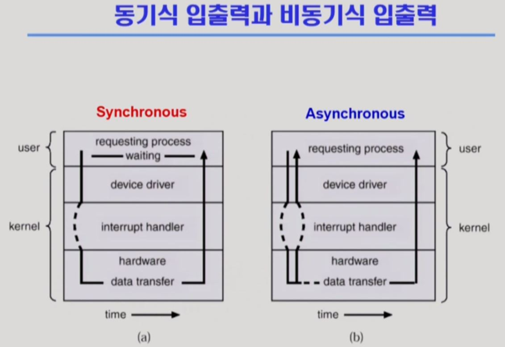
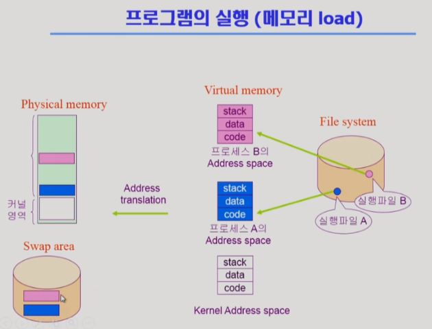
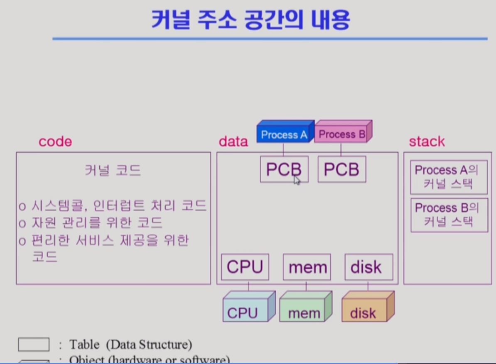
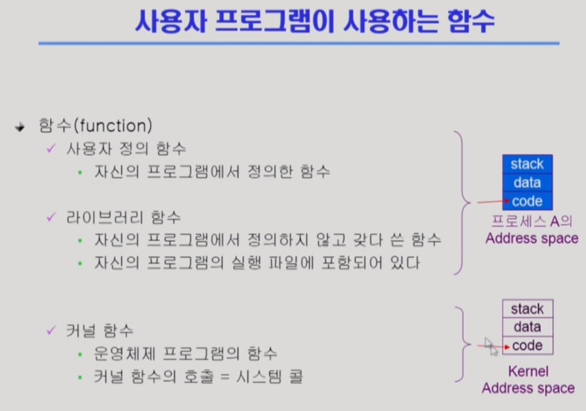

# os.2 시스템 구조와 프로그램 실행

## 1. 컴퓨터 시스템 구조

- cpu
  - 매 클럭마다  메모리에서 인스트럭션을 불러 실행한다.
  - 클럭과 인스트럭션?
- memory
  - cpu의 작업 공간
- I/O device
  - device controller: 각 디바이스마다 앞단에 작은 cpu의 역할을 하는 컨트롤러가 존재 / cpu의 작업 공간(메모리)이 필요하다. 로컬 버퍼라고 부른다
- timer
  - 하나의 프로그램이 cpu를 독점하는것을 마기 위해 임의의 expire time을 설정(1초미만)하여 cpu의 시분할 작업을 가능하게 함

## 2. 동기식 비동기식 입출력

### 2.1. 동기식 입출력 (synchronous I/O)

- I/O 요청 후 입출력 작업이 완료된 후에야 제어가 사용자 프로그램에 넘어감
- 구현방법1
  - I/O가 끝날때 까지 cpu를 낭비시킴
  - 매 시점 하나의 I/O만 일어날 수 있음
- 구현방법2(시분할 방식에 가까움)
  - I/O가 완료될 때까지 해당 프로그램에게서 CPU를 빼았음
  - I/O 처리를 기다리는 줄에 그 프로그램을 줄 세움
  - 다른 프로그램에게 CPU를 줌 

### 2.2 비동기식 입출력(asynchronous I/O)

- I/O가 시작된 후 입출력 작업이 끝나기를 기다리지 않고 제어가 사용자 프로그램에 즉시 넘어감
- 보통 write 작업에서 비동기식으로 작업하도록 설계함

> 두 경우 모두 I/O의 완료를 **인터럽트**가 알려준다.

## 3. 메모리 load

- 실팽파일 a를 실행하면, 각각 가상 메모리에 주소 공간을 할당한다. 
  - stack: 각 함수를 실행할때마다 로컬데이터를 할당하는 공간, 후입선출방법으로 관리
  - data: 전역변수 등을 관리
  - code: 기계어로 번역된 실행코드
- logical memory -> pysical memory

- 커널영역을 확대해서 보면 다음과 같다.

  

- 하나의 프로그램을 함수로 바라볼때, 다음과 같이 분류할 수 있다.

  

  - 이때, 사용자 정의 함수에서 커널함수를 호출하고 싶다면(I/O device를 이용하고 싶을때) 커널 함수로 직접 호출할 수 없기 때문에, `시스템 콜`을 통해 `인터럽트`를 실행하고, cpu 제어권을 커널이 갖게 한 후, 커널함수를 호출하여 해당 작업을 완료한 다음 다시 사용자 함수를 실행하도록 cpu 제어권을 돌려주는 일련의 과정이 전반적인 함수의 라이프 사이클이다. 
  - 다음이 라이프 사이클의 일반화 한 도식이다. 

  

## 출처

- 이화여자대학교 os 강의 - 반효경 교수님
- 링크: https://core.ewha.ac.kr/publicview/C0101020140314151238067290?vmode=f

